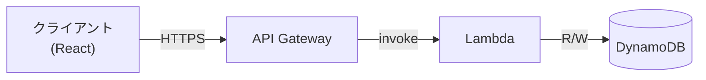
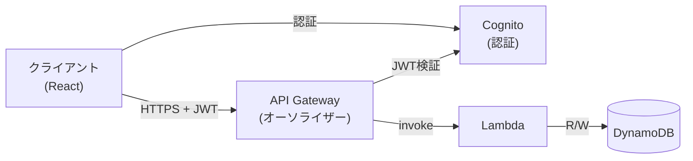

# システムアーキテクチャ

## 全体構成

## コンポーネント概要

| コンポーネント | 役割 |
|---|---|
| React (Vite) | フロントエンドUI。APIを呼び出してツリーを表示・操作する |
| API Gateway | HTTPリクエストを受け取りLambdaに転送する |
| Lambda | ビジネスロジックの実行。DynamoDBの読み書きを担う |
| DynamoDB | ノードツリーの永続化 |

## 認証フェーズ別構成

### フェーズ1（現在）: 認証なし

- 固定ユーザー `USER#default` でデータを読み書き
- API Gatewayに認証なし

### フェーズ2（将来）: Cognito認証追加

- API GatewayにCognitoオーソライザーを追加
- LambdaでJWTから `uid` を取り出して `PK: "USER#{uid}"` に切り替える
- フロントエンド・DynamoDBスキーマの変更は不要
